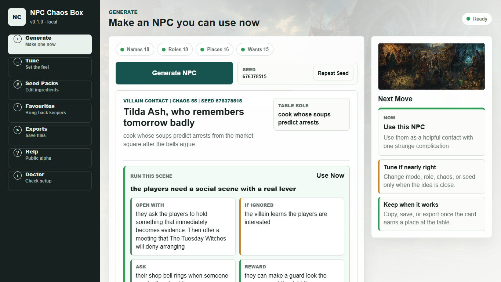
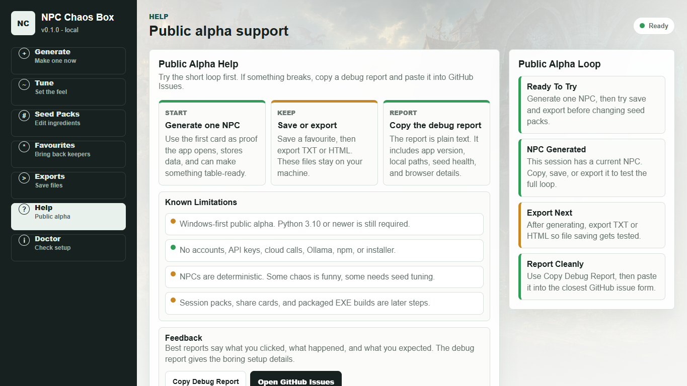
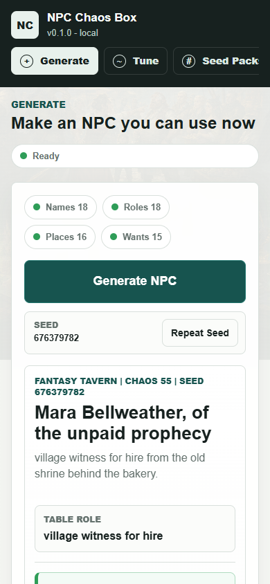

# NPC Chaos Box

**A local-first NPC generator for tabletop games, writing, solo RPGs, and worldbuilding.**

Press one button and get a character you can actually use at the table: what they want, what they know, what they ask the players to do, what happens if ignored, and the strange little twist that makes them memorable.

- [Download the public alpha ZIP](https://github.com/Martin123132/NPCChaosBox/releases/download/v0.1.0/NPCChaosBox-v0.1.0.zip)
- [Open the release page](https://github.com/Martin123132/NPCChaosBox/releases/tag/v0.1.0)

No accounts. No AI API keys. No cloud calls. No Ollama. No npm. No build step.



## Quick Start

Windows public alpha:

1. Download `NPCChaosBox-v0.1.0.zip`.
2. Unzip it somewhere easy, preferably on the D drive.
3. Double-click `START_NPCChaos_WINDOWS.bat`.
4. Your browser opens.
5. Press `Generate NPC`.

If Python is missing, install Python 3.10 or newer from:

```text
https://www.python.org/downloads/windows/
```

Tick `Add python.exe to PATH`, then double-click the launcher again.

## What It Makes

Each NPC card is built for use, not just flavour text:

- `Use Now`: when to drop them into the session.
- `Open With`: how the scene starts.
- `If Ignored`: what gets worse.
- `Ask`: what they want from the players.
- `Reward`: what the players can gain.
- `Catch`: the complication attached to helping.
- `Read Aloud`: a line you can say at the table.
- `Chaos Trace`: the deterministic seed trail behind the result.

The generator uses local seed banks, prime traces, drift, and collision rules to make strange but playable NPCs without calling any AI service.

## Screenshots

| Public alpha help | Mobile view |
|---|---|
|  |  |

## App Pages

- `Generate`: make one NPC card, then copy, save, or export it.
- `Tune`: pick the mode, role, chaos level, and seed behaviour.
- `Seed Packs`: edit the ingredients one line at a time.
- `Favourites`: keep useful NPCs and load them back later.
- `Exports`: save TXT table notes or a clean HTML card.
- `Help`: public alpha guide, known limits, GitHub Issues link, and debug report.
- `Doctor`: plain-English local health, file paths, and seed-count evidence.

The app uses traffic-light guidance:

- Green: ready.
- Amber: usable, but worth improving.
- Red: blocked or too thin.

## Where Files Go

The launcher stores runtime data beside the app by default:

```text
user-data\
temp\
```

Exports, favourites, and seed edits stay local on your machine.

For development or portable runs, set:

```powershell
$env:NPC_CHAOS_HOME = "D:\NPCChaosData"
```

## Public Alpha Feedback

This release is meant to be tested in public. If something breaks:

1. Open the app.
2. Go to `Help`.
3. Press `Copy Debug Report`.
4. Paste it into the closest GitHub issue form.

[Open GitHub Issues](https://github.com/Martin123132/NPCChaosBox/issues/new/choose)

Issue forms are included for:

- `It would not open`: Python, launcher, browser, or Windows first-run trouble.
- `Export or save problem`: favourites, TXT, HTML, or folder opening.
- `Generated NPC felt wrong`: repetitive, weak, confusing, or not table-ready output.
- `Feature idea`: small improvements and future workflows.

Known limitation: this is a Windows-first public alpha and still requires Python 3.10 or newer.

## For Maintainers

D-drive safe local setup:

```powershell
New-Item -ItemType Directory -Force -Path D:\Temp, D:\NPCChaosData, D:\NPCChaosVerifyWork | Out-Null
$env:TEMP = "D:\Temp"
$env:TMP = "D:\Temp"
$env:NPC_CHAOS_HOME = "D:\NPCChaosData"
$env:NPC_CHAOS_DISABLE_OPEN = "1"
```

Manual start:

```powershell
python -m npc_chaos_app.app
```

Health check:

```powershell
python -m npc_chaos_app.app --doctor
```

Development checks:

```powershell
python -m unittest discover -s tests
python -m compileall npc_chaos_app tests scripts
python scripts\first_run_acceptance.py --data-dir D:\NPCChaosAcceptanceData --temp-dir D:\Temp
python scripts\sample_npcs.py --count 5
python scripts\review_npcs.py --count 50
```

Build and verify a release ZIP:

```powershell
powershell -ExecutionPolicy Bypass -File scripts\make_release_zip.ps1
$zip = (Get-ChildItem dist\NPCChaosBox-v*.zip | Sort-Object LastWriteTime -Descending | Select-Object -First 1).FullName
powershell -ExecutionPolicy Bypass -File scripts\verify_release_zip.ps1 -ZipPath $zip -WorkRoot D:\NPCChaosVerifyWork
```

Stop any local dev server left open:

```powershell
powershell -ExecutionPolicy Bypass -File scripts\stop_dev.ps1
```

## License

NPC Chaos Box is source-available for personal and non-commercial use under the PolyForm Noncommercial License 1.0.0. See `LICENSE`.

## V0.1 Promise

NPC Chaos Box should be explainable over the phone: download ZIP, unzip, double-click, press `Generate NPC`. It should stay useful before it gets clever.
